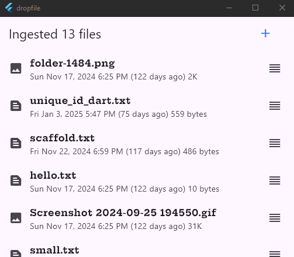

# dropfile

Dropfile is a demo app for the desktop.

## About

Dropfile is a tool for showing drag'n'drop behavior on a Windows Desktop.

The currently dropped files (aka ingested files) 
are displayed in a list with a bit of metadata.

A "+" button is provided to add files to the list using a file picker.

The files are stored in SQLite and are persisted between app restarts.

## Authors

- [Doug MacMillan](https://github.com/cgdougm)
- [WindsurfAI](https://codeium.com/windsurf)
- [Cursor](https://codeium.com/cursor)

## Acknowledgments

- [Flutter](https://flutter.dev/)
- [Desktop Drop](https://pub.dev/packages/desktop_drop)
- [File Selector](https://pub.dev/packages/file_selector)
- [MIME](https://pub.dev/packages/mime)
- [Image](https://pub.dev/packages/image)
- [Intl](https://pub.dev/packages/intl)
- [Path](https://pub.dev/packages/path)
- [File Picker](https://pub.dev/packages/file_picker)
- [Cross File](https://pub.dev/packages/cross_file)
- [Crypto](https://pub.dev/packages/crypto)
- [SQFLite Common FFI](https://pub.dev/packages/sqflite_common_ffi)
- [Provider](https://pub.dev/packages/provider)

## License

MIT License
